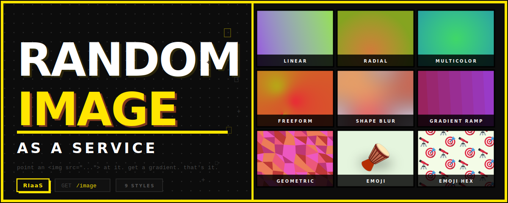

Point an `` tag at it and get a gradient. Different every time, or pinned with a seed.

Nine styles: linear fades, radial blends, multi-stop color fields, freeform blobs, glassmorphism, banded ramps, low-poly geometry, and emoji — single or tiled in a hexagonal honeycomb.

---

## HTML

```html

```

That's the whole thing. Add parameters to control what you get:

> **Hugging Face free-tier Spaces go to sleep after 48 h of inactivity.** Any HTTP request wakes the Space, but HF's proxy handles the first ~30–60 s of boot itself — your `` gets an HTML "waking up" page instead of a PNG. Use the self-waking embed below to handle this automatically.

```html
<!-- pick a size -->


<!-- pick a style -->


<!-- pin it — same seed always returns the same image -->

```

As a CSS background:

```css
.hero {
  background-image: url("https://huggingface.co/spaces/aakkaasshh/Random-Image-as-a-Service/image?width=1920&height=1080&style=shape_blur");
  background-size: cover;
}
```

In Markdown:

```markdown

```

As an OG image:

```html
<meta property="og:image" content="https://huggingface.co/spaces/aakkaasshh/Random-Image-as-a-Service/image?width=1200&height=630&seed=7">
```

### Self-waking embed

If the Space might be sleeping, use this instead of a bare ``:

```html

```

How it works:
- `onerror` fires when the browser gets HF's HTML wake-page instead of a PNG
- After 10 s it retries with a cache-busting `?t=` param
- Keeps retrying every 10 s until the Space is awake and returns a real image
- Once the Space is up the image loads and `onerror` never fires again

To never hit the sleep state at all, point an uptime monitor (UptimeRobot free tier) at `https://huggingface.co/spaces/aakkaasshh/Random-Image-as-a-Service/image` every 5 minutes. Any hit counts as activity to HF, so the Space never goes idle.

---

## API

`GET /image` returns a PNG. All parameters are optional.

| Parameter | Default | Allowed values |
|---|---|---|
| `width` | 1024 | 64 – 4096 |
| `height` | 768 | 64 – 4096 |
| `style` | random | `linear` `radial` `multicolor` `freeform` `shape_blur` `gradient_ramp` `geometric` `emoji` `emoji_hex` |
| `seed` | random | any integer |

Bad dimensions return HTTP 400 with a JSON error body. Everything else is a PNG byte stream.

### Speed

When hosted on Hugging Face Spaces (or run locally via `python app.py`), the Gradio server pre-generates a pool of 50 images at startup. Bare requests with no parameters are served from that pool — **~1ms turnaround**, no generation overhead:

```
GET /image               → pool hit  (X-RIaaS-Source: pool)  ~1ms
GET /image?style=linear  → generated (X-RIaaS-Source: live)  ~50–200ms
```

The pool builds in the background; during the first ~15 seconds the server falls through to live generation automatically.

### curl

```bash
# save one
curl "https://huggingface.co/spaces/aakkaasshh/Random-Image-as-a-Service/image?style=geometric&width=800&height=600" -o banner.png

# batch — 20 different seeds
for i in $(seq 1 20); do
  curl "https://huggingface.co/spaces/aakkaasshh/Random-Image-as-a-Service/image?seed=$i" -o "img_$i.png"
done
```

### Python

```python
import io, urllib.request
from PIL import Image

with urllib.request.urlopen("https://huggingface.co/spaces/aakkaasshh/Random-Image-as-a-Service/image?style=emoji_hex&seed=9") as r:
    img = Image.open(io.BytesIO(r.read()))

img.save("out.png")
```

Interactive docs at `/docs` (Swagger) and `/redoc`.

---

## Gradio

The Gradio UI is at `https://huggingface.co/spaces/aakkaasshh/Random-Image-as-a-Service` (or `http://localhost:7860` locally). Sliders for width and height, a style dropdown, a seed box, and a live preview. For programmatic use, `GET /image` is all you need.

---

## Running locally

```bash
git clone https://github.com/AkashSCIENTIST/Random-Image-as-a-Service
cd Random-Image-as-a-Service
pip install -r requirements.txt
```

**Gradio + API server** (one command gives you both the UI and `GET /image`):

```bash
python app.py
# UI  → http://localhost:7860
# API → http://localhost:7860/image
```

Or with uvicorn for production:

```bash
uvicorn app:app --host 0.0.0.0 --port 7860
```

**FastAPI-only server** (lighter, no UI):

```bash
uvicorn api:app --reload
# http://localhost:8000/image
```

**Without a server** — call the generator directly:

```python
from core.service import generate

img, meta = generate(width=1024, height=768, style="emoji_hex", seed=42)
img.save("out.png")
print(meta)
# {'style': 'emoji_hex', 'width': 1024, 'height': 768, 'seed': 42, 'params': {...}}
```

**Deploy to Hugging Face Spaces** — create a Space with SDK: Gradio, then:

```bash
git remote add space https://huggingface.co/spaces/aakkaasshh/Random-Image-as-a-Service
git push space main
```

Spaces detects the FastAPI `app` object in `app.py` and serves it with uvicorn. You get the Gradio UI at `/` and `GET /image` on the same URL — pool-backed, ~1ms after warmup.

---

## Styles

| Name | Description |
|---|---|
| `linear` | Two colors fading at any angle |
| `radial` | Circular fade from center |
| `multicolor` | 3–5 color stops, linear or radial |
| `freeform` | Two colors blended through scattered control points |
| `shape_blur` | Blurred translucent blobs on a light base |
| `gradient_ramp` | Gradient cut into hard color bands |
| `geometric` | Low-poly triangles in a coordinated palette |
| `emoji` | Single emoji on a plain background with a soft oval shadow |
| `emoji_hex` | Two emojis tiled on a honeycomb lattice — each surrounded entirely by the other |

---

## Adding a style

1. Add `styles/my_style.py` — extend `GradientStyle`, implement `render()`, add `random_params()`.
2. Register it in `core/registry.py`.
3. Add the name to `VALID_STYLES` in `core/config.py`.

It shows up in the API, the Gradio dropdown, and `generate()` automatically.
